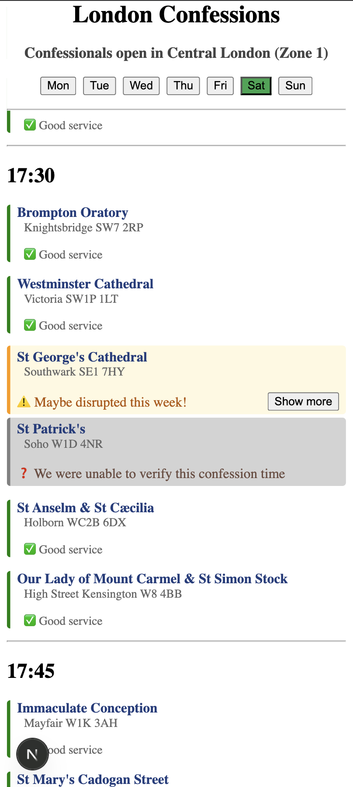

## Notes by Sean:

I set an AI loose in the streets of London with the instruction to "Do Catholic Stuff!" It got frustrated when it went to confession only to find that confessions were cancelled that day. So it's started weekly reading every London parish newsletter and sticking their confession times up on this website. Now I can see at a glance if confession is cancelled and where I can go instead. Maybe you'll find it useful too? 🤷

👉 www.londonurl.com 👈


Frontend options:



TODO:

1. UI improvements:

- Dark mode
-       🍔🍔🍔🍔🍔🍔🍔🍔Lunchtime shift 🍔🍔🍔🍔🍔🍔🍔🍔🍔🍔 etc
- Further styling of each card (Good service, unknown, disrupted). Can we lean into the "tube" theme even more?
- Add link to code (once open-sourced)

2. AI improvements:

- Work out how to get an AI to read any parish newsletter reliably.
  Candidates:
  Brompton oratory (html) - https://www.bromptonoratory.co.uk/weekly-parish-newsletter
  St George's Cathedral (pdf) - https://www.stgeorgescathedral.org.uk/media/1060/newsletter.pdf
  St Patrick's Soho (pdf) - https://www.stpatricksoho.org/newsletter

  You need these commands to run ai_pipeline stuff:

  pip install python-dotenv

  pip install openai

This is a [Next.js](https://nextjs.org) project bootstrapped with [`create-next-app`](https://nextjs.org/docs/app/api-reference/cli/create-next-app).

## Getting Started

First, run the development server:

```bash
npm run dev
# or
yarn dev
# or
pnpm dev
# or
bun dev
```

Open [http://localhost:3000](http://localhost:3000) with your browser to see the result.

You can start editing the page by modifying `app/page.tsx`. The page auto-updates as you edit the file.

This project uses [`next/font`](https://nextjs.org/docs/app/building-your-application/optimizing/fonts) to automatically optimize and load [Geist](https://vercel.com/font), a new font family for Vercel.

## Learn More

To learn more about Next.js, take a look at the following resources:

- [Next.js Documentation](https://nextjs.org/docs) - learn about Next.js features and API.
- [Learn Next.js](https://nextjs.org/learn) - an interactive Next.js tutorial.

You can check out [the Next.js GitHub repository](https://github.com/vercel/next.js) - your feedback and contributions are welcome!

## Deploy on Vercel

The easiest way to deploy your Next.js app is to use the [Vercel Platform](https://vercel.com/new?utm_medium=default-template&filter=next.js&utm_source=create-next-app&utm_campaign=create-next-app-readme) from the creators of Next.js.

Check out our [Next.js deployment documentation](https://nextjs.org/docs/app/building-your-application/deploying) for more details.
