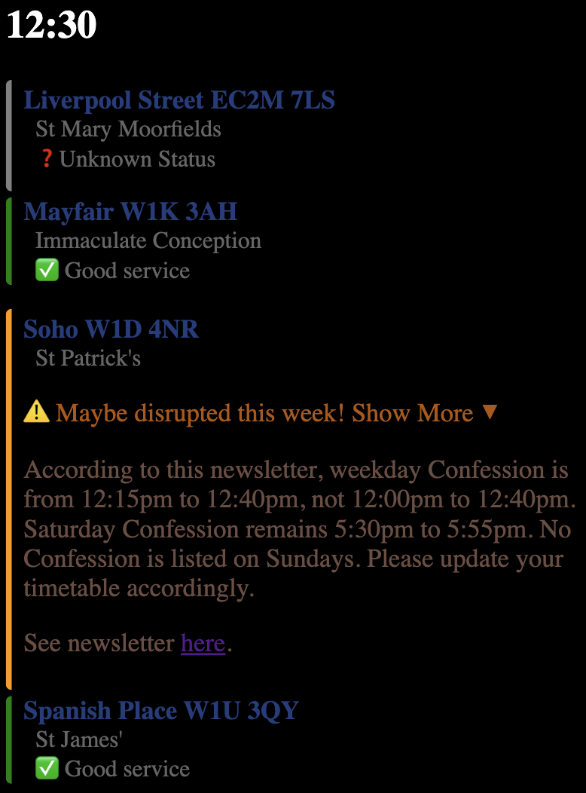

## London Confessions

I set an AI loose in the streets of London with the instruction to "Do Catholic Stuff!" It got frustrated when it went to confession only to find that confessions were cancelled that day. So it's started reading every London parish newsletter each week and sticking their confession times up on this website. Now I can see at a glance if confession is cancelled and where I can go instead. Maybe you'll find it useful too? 🤷

👉 www.londonurl.com 👈


## How it works: Non-Technical Explanation

The confession times of every church in Central London (Zone 1) are listed on this website.(\*)

For each church, we give chatGPT a copy of this week's parish newsletter and ask it "Are these confession times accurate according to this newsletter?" If the times are inaccurate, chatGPT gives us a brief assessment highlighting the difference. This is where the "disruption" notices come from:



If the newsletter does not detail any changes to this week's confession schedule, then it is marked as "✅ Good service".

Some churches are marked as "Unknown status". This can happen for a few reasons, the most likely ones being:

- The church doesn't keep an up-to-date online newsletter.
- The AI took too long to understand the newsletter so we gave up.
- The AI has gone on strike until I put more money into my openAI account.

(\*) Only English-speaking, Catholic churches that maintain a publically accessible newsletter are included. So churches like the Ukrainian Catholic Cathedral in Mayfair are excluded from this website. I don't want to send American tourists to confess their sins in Ukrainian at 6:45AM!

## How it works: "Carlo Acutis" Level explanation

This is a Next.js project with a Typescript frontend and a Python backend. Inside the `ai_pipeline` folder, newsletters are scraped from parish websites using Selenium. These newsletters are posted to the chatGPT API with the relevant prompt (see `prompts.py`) and are then written to json (`appraisals.json`). That json file is used to configure the frontend.

## TODO
-(Frontend) Remove Ukrainian Cathedral and Notre Dame de France

TODO:

1. UI improvements:

- Dark mode
-       🍔🍔🍔🍔🍔🍔🍔🍔Lunchtime shift 🍔🍔🍔🍔🍔🍔🍔🍔🍔🍔 etc
- Further styling of each card (Good service, unknown, disrupted). Can we lean into the "tube" theme even more?
- Add link to code (once open-sourced)

2. AI improvements:

- Work out how to get an AI to read any parish newsletter reliably.
  Candidates:
  Brompton oratory (html) - https://www.bromptonoratory.co.uk/weekly-parish-newsletter
  St George's Cathedral (pdf) - https://www.stgeorgescathedral.org.uk/media/1060/newsletter.pdf
  St Patrick's Soho (pdf) - https://www.stpatricksoho.org/newsletter

  You need these commands to run ai_pipeline stuff:

  pip install python-dotenv

  pip install openai

This is a [Next.js](https://nextjs.org) project bootstrapped with [`create-next-app`](https://nextjs.org/docs/app/api-reference/cli/create-next-app).

## Getting Started

First, run the development server:

```bash
npm run dev
# or
yarn dev
# or
pnpm dev
# or
bun dev
```

Open [http://localhost:3000](http://localhost:3000) with your browser to see the result.

You can start editing the page by modifying `app/page.tsx`. The page auto-updates as you edit the file.

This project uses [`next/font`](https://nextjs.org/docs/app/building-your-application/optimizing/fonts) to automatically optimize and load [Geist](https://vercel.com/font), a new font family for Vercel.

## Learn More

To learn more about Next.js, take a look at the following resources:

- [Next.js Documentation](https://nextjs.org/docs) - learn about Next.js features and API.
- [Learn Next.js](https://nextjs.org/learn) - an interactive Next.js tutorial.

You can check out [the Next.js GitHub repository](https://github.com/vercel/next.js) - your feedback and contributions are welcome!

## Deploy on Vercel

The easiest way to deploy your Next.js app is to use the [Vercel Platform](https://vercel.com/new?utm_medium=default-template&filter=next.js&utm_source=create-next-app&utm_campaign=create-next-app-readme) from the creators of Next.js.

Check out our [Next.js deployment documentation](https://nextjs.org/docs/app/building-your-application/deploying) for more details.

Frontend options:


